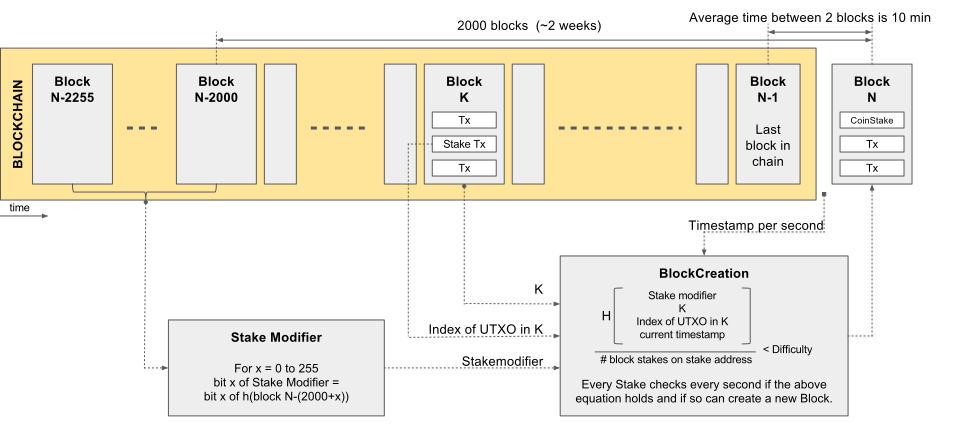
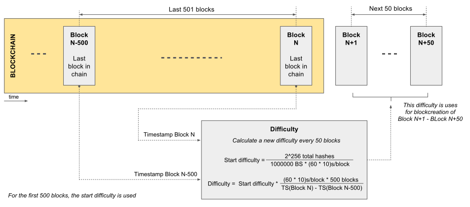

Proof Of BlockStake
===================

This document is meant to provide a good high level overview of the BlockStake
algorithm.

General
-------

Block stakes are an alternative currency, living next to the regular 'coin' currency. Block stakes is however a finite currency, and the total amount of block stakes available in a single network is defined as part of the genesis blocks, which also defines the initial distribution of which. Block stakes are stored in a wallet, next to regular coins, and can be also send to other wallets. Sending of block stakes is however a bit different from sending coins, we'll come back to this later. Just remember already that the genesis block only defines the initial distribution, given that they can be send around afterwards, the distribution at any given point in the future is undefined. The only cost of sending those, is the transaction fee that has to be paid for the transaction in which the relevant block stakes are defined as outputs.

Block stakes are required in order to create blocks, and thus every blockcreator has at least one block stake. The more block stakes, the more change you have to mint the next block. Should a single party possess a majority of block stakes, it could disrupt the network, even though not undetectable.

protocol
--------

The hash function used is a 32-byte BLAKE2b hash. To compare the hash with the difficulty it is interpreted as a big-endian unsigned integer.

Maturity of Blockstakes
-----------------------
In the proof of blockstake protocol, the used blockstakes are resend to the blockcreator in the very first transaction of the block. If someone sends blockstakes to someone else, these blockstakes need to mature for 256 blocks in order to become eligible for participation in the proof of blockstake protocol. 

This prevents the following attacks:
- For used blockstakes, this is always index 0, this prevents mining.

- When an adversary mints a block, a fake transaction of BlockStake he also owns can be put it in the transaction list and this way influence the index of this BlockStakes UTXO. This way the BlockCreation equation can be influenced.

- Another way is to put a BlockStake transaction in the network at a specific time and hope it will be in a specific block that will be minted by an honest minter. This way K in the blockcreation equation can be influenced.

Transaction fees
----------------

For every transaction, a fee (exact amount to be determined) is charged.

### Maturity of collected transaction fees

Coins received through the collection of transaction fees during block creation can't be spent until the block has 144 confirmations. Transactions that try to spend a block creation fee output before this will be rejected.

The reason for this is that sometimes the block chain forks, blocks that were valid become invalid, and the block creation reward in those blocks is lost. That's just an unavoidable part of how blockchains works, and it can sometimes happen even when there is no one attacking the network. If there was no maturation time, then whenever a fork happened, everyone who received coins that were collected on an unlucky fork (possibly through many intermediaries) would have their coins disappear, even without any sort of double-spend or other attack. On long forks, thousands of people could find coins disappearing from their wallets, even though there is no one actually attacking them and they had no reason to be suspicious of the money they were receiving. For example, without a maturation time, a block creator might deposit 25 coins into an EWallet, and if I withdraw money from a completely unrelated account on the same EWallet, my withdrawn money might just disappear if there is a fork and I'm unlucky enough to withdraw coins that have been "tainted" by the block creator's now-invalid coins. Due to the way this sort of taint tends to "infect" transactions, far more than 25 coins per block would be affected. Each invalidated block could cause transactions collectively worth hundreds of coins to be reversed. The maturation time makes it impossible for anyone to lose coins by accident like this as long as a fork doesn't last longer than 144 blocks.

Difficulty
----------

The hash in the POBS protocol results in a 256 bit integer so there are 2^256 possible combinations. If we want 1 block to be created every 10 minutes on average, this means that 1 hash should match every 10\*60 seconds.
The chance of having a match is also multiplied by the number of blockstakes you have available so for the starting difficulty this means it should be divided by the total number of blockstakes in the system.

Difficulty is adjusted every 50 blocks to compensate for the fact that not every blockstake available is always participating in the POBS protocol.

