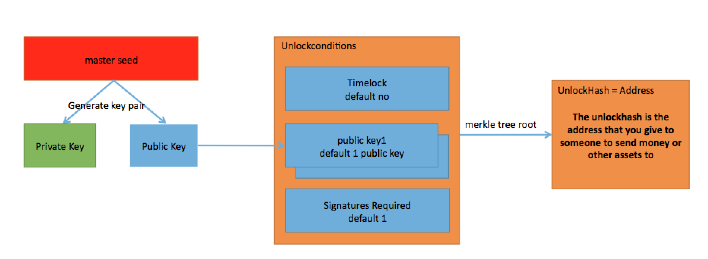
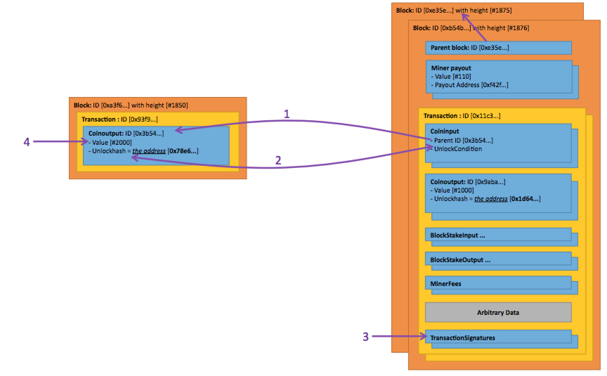
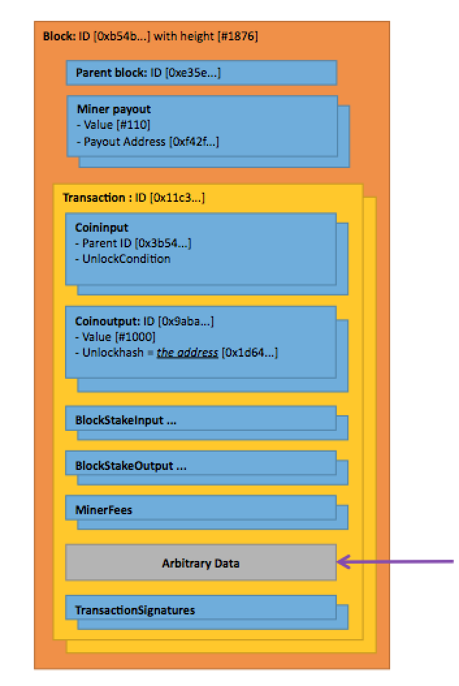

# Transactions

## Generate address from master seed

## Send coins

Send coins from 0x78e6... to 0x1d64..

When spending money you need to add a coininput in a transaction, info needed in coininput is:
1. ParentID is the ID of the unspend coinoutput (UTXO)
2. Recalculate the unlockconditions that generates the unlockhash (normally they are standard and can be reconstructed)
3. Use the corresponding private key to sign a transactionSignature.
4. The money that can be spent in the transaction is found in the corresponding coinoutput. ex. Value = 2000

Per transaction: The sum of all values in coinoutput should be less than the sum of all "unlocked" values in the coininput. The difference is minerfee for the the block generator.

## Arbitrary data

Arbitrary Data can be of any size. There is however a size limit on a Transaction and a block.
Keep in mind that the fee is depending on the size of a transaction, a blockcreator can ignore to add a transaction with small fees for a lot of small transactions with a summed up bigger fee (opportune).

Arbitrary data can be used to make verifiable announcements, or to have other
protocols sit on top of Rivine. The arbitrary data can also be used for soft
forks, and for protocol relevant information. Any arbitrary data is allowed by
the consensus.

## Double Spend Rules

When two conflicting transactions are seen, the first transaction is the only
one that is kept. If the blockchain reorganizes, the transaction that is kept
is the transaction that was most recently in the blockchain. This is to
discourage double spending, and enforce that the first transaction seen is the
one that should be kept by the network. Other conflicts are thrown out.

Transactions are currently included into blocks using a first-come first-serve
algorithm. Eventually, transactions will be rejected if the fee does not meet a
certain minimum. For the near future, there are no plans to prioritize
transactions with substantially higher fees. Other mining software may take
alternative approaches.
